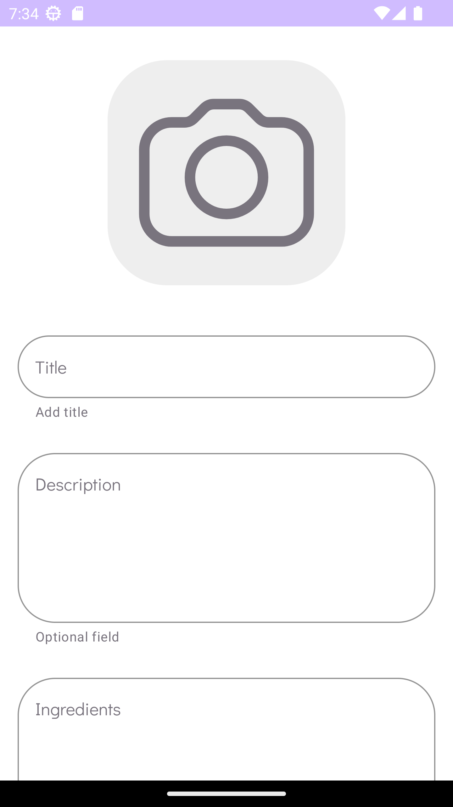

# CocktailsAppForSurfSummerSchool

This project was developed as part of the Surf summer school. Subsequently it was improved beyond the TOR by using third-party API https://www.thecocktaildb.com/.

It is an application for creating, viewing and editing cocktails.

# Features
- MVVM architecture pattern
- Clean Architecture
- Storing data using Room database
- Koin for DI

# Gallery

<li>
  Splash
</li>
<li>
  
</li>

<li>
 No cocktails
</li>
<li>
  
</li>

<li>
 Adding cocktail 1
</li>
<li>
  
</li>

<li>
  Adding cocktail 2
</li>
<li>
  
</li>

<li>
  Adding cocktail 3
</li>
<li>
  
</li>

<li>
  Cocktail added
</li>
<li>
  
</li>

<li>
  Cocktail info
</li>
<li>
  
</li>

<li>
 Edit cocktail
</li>
<li>
  
</li>
